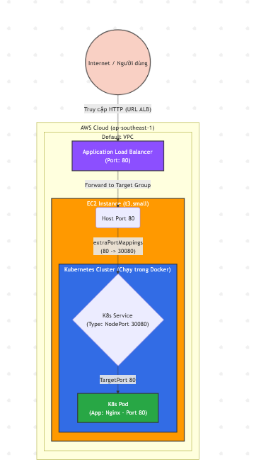

# 🚀 K8s on AWS - Terraform 1-Click Challenge

Repo này tự động hóa việc dựng hạ tầng AWS (VPC mặc định, EC2, ALB, Security Groups) và triển khai cụm Kubernetes (Kind) chứa ứng dụng Nginx bằng **duy nhất 1 lệnh Terraform**.

## 1. Hướng dẫn chạy (How to run)

Yêu cầu: Đã cài đặt Terraform CLI và cấu hình AWS CLI (Region `ap-southeast-1`).

### Bước 1: Khởi tạo

```bash
terraform init
```

### Bước 2: Triển khai

```bash
terraform apply -auto-approve
```

_Lưu ý: Cần đợi khoảng 4 - 5 phút sau khi lệnh hoàn tất để `user_data` cài đặt K8s và kéo ứng dụng lên trước khi truy cập URL ALB._

### Bước 3: Dọn dẹp hệ thống

```bash
terraform destroy -auto-approve
```

## 2. Sơ đồ kiến trúc



## 3. Giải thích thiết kế & Wire Provider

### Wire Provider >= 2

- Project sử dụng 3 providers: `aws`, `tls`, và `local`.
- Thay vì cố móc nối provider kubernetes vào K8s ẩn trong EC2 (dễ sinh lỗi timeout khi host chưa kịp chạy), giải pháp là dùng tls để tự động sinh khóa RSA, sau đó dùng local lưu file `.pem` về máy tính cục bộ. Việc này vừa thỏa mãn yêu cầu wire provider, vừa cung cấp khóa SSH ngay lập tức để debug nếu cần.

### Luồng chạy của app

Cụm K8s (Kind) được bootstrap tự động qua user_data của EC2. Kind được cấu hình extraPortMappings để map Port 80 của EC2 host vào Port 30080 của cụm K8s. Nhờ thiết kế này, ALB chỉ cần forward traffic tới Port 80 của EC2 là App Nginx bên trong Pod sẽ nhận được phản hồi.
