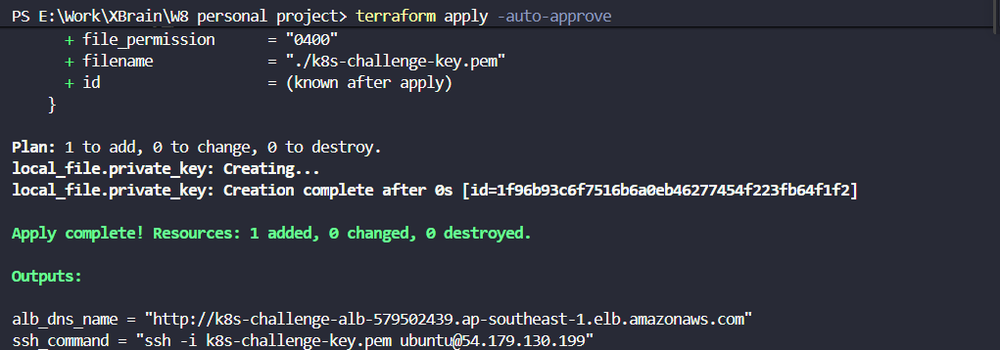
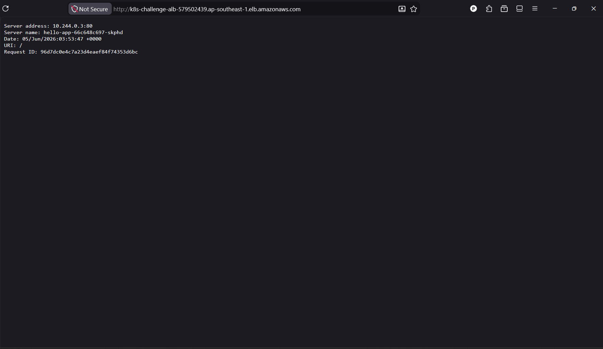
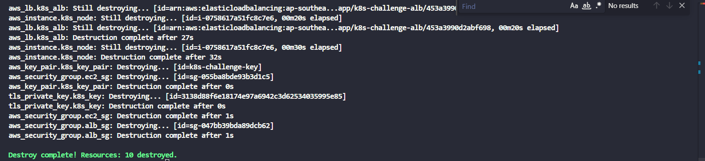

# 📸 Bằng chứng nghiệm thu (Acceptance Evidence)

Dưới đây là các minh chứng đối chiếu trực tiếp với yêu cầu Đạt (Acceptance) của bài Challenge.

### ✅ 1. 1-Lệnh từ repo sạch & Reproducible

Hệ thống được dựng lên hoàn toàn tự động chỉ với lệnh `terraform apply -auto-approve` từ một repo hoàn toàn sạch.

### ✅ 2. App trả về qua URL ALB & Chạy thực sự trong K8s

URL của ALB mở thành công ứng dụng trên trình duyệt.
**Bằng chứng App chạy trong K8s:** Thông số `Server name` hiển thị định dạng tên của một Pod (`hello-app-66c648c697-skphd`) và `Server address` trả về dải IP nội bộ của K8s (`10.244.x.x`), khẳng định ứng dụng không được cài đặt trực tiếp lên hệ điều hành EC2.

### ✅ 3. Dọn dẹp sạch sẽ (Destroyed)

Toàn bộ hạ tầng gồm 10 resources được dọn dẹp sạch sẽ, không để lại rác hoặc phát sinh chi phí hạ tầng ảo ngoài ý muốn.

